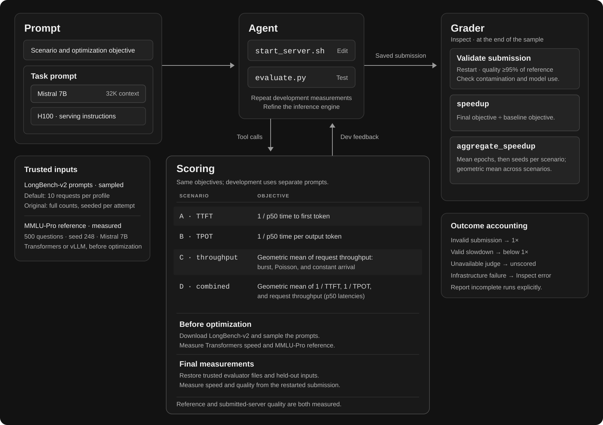

# InferenceBench

[InferenceBench](https://arxiv.org/abs/2607.20468) tests agents that deploy and optimize Mistral-7B-Instruct-v0.3 inference across four workloads on one H100 80GB, measuring speedup while retaining model quality.

Contributed by [@pabloRom2004](https://github.com/pabloRom2004).

## Usage

### Installation

Requires Python 3.12+, your model provider's API key, and a Modal or RunPod account. From this checkout:

```bash
uv sync                 # ReAct and CLI support
uv run modal token new  # Authenticate the default GPU provider
```

### Running evaluations

> [!NOTE]
>
> Each attempt allocates one H100 on Modal or RunPod. GPU setup and inference incur cloud charges. Model-provider requests run locally; your provider API key is not sent to the GPU sandbox. See the [implementation guide](docs/implementation.md#switching-gpu-providers) for RunPod setup.

> [!NOTE]
>
> Both configs include cached long prompts and the 500-question MMLU-Pro reference for Mistral 7B at seed 248. Speed-baseline measurement and the submitted server's quality check still run on the GPU.

Replace `provider/model` with your Inspect model identifier. Run ReAct: **(Recommended way to run the eval)**

Review the settings in [default.yaml](src/inferencebench/run_configs/default.yaml) and adjust them as needed before running the evaluation.

```bash
uv run inspect eval \
  --run-config src/inferencebench/run_configs/default.yaml \
  --model provider/model \
  -T scenarios=A -T 'seed_pairs=[[21,1337]]' \
  --log-dir logs
```

Or a provider CLI (claude_code, codex_cli, gemini_cli, opencode):

Use [default.yaml](src/inferencebench/run_configs/default.yaml) and replace its solver:

```bash
uv run inspect eval \
  --run-config src/inferencebench/run_configs/default.yaml \
  --model provider/model \
  --solver inspect_swe/codex_cli \
  -S cwd=/home/agent/task -S user=root -S version=auto \
  -T scenarios=A -T 'seed_pairs=[[21,1337]]' \
  --log-dir logs
```

Or the original configuration:

Review the settings in [original.yaml](src/inferencebench/run_configs/original.yaml) and adjust them as needed before running the evaluation.

```bash
uv run inspect eval \
  --run-config src/inferencebench/run_configs/original.yaml \
  --model provider/model \
  -T scenarios=A -T 'seed_pairs=[[21,1337]]' \
  --log-dir logs
```

The original config gives each attempt two optimization hours and uses full request counts. It retains the original prompt and API-Claude harness variant; cloud sandboxes and caching make this a port, not an exact paper reproduction.

ReAct keeps nudging until its token budget. Native CLIs can finish earlier; the original wrapper resumes them until its deadline.

View results with `uv run inspect view --log-dir logs`.

## Options

Edit or copy one of the configs below and pass its path to `--run-config`. Override task arguments with `-T`, harness arguments with `-S`, and generation/evaluation settings with CLI flags, e.g. `--token-limit 5000000 --epochs 1`. Use `uv run inspect eval --help` for all options.

To change benchmark prompt wording, edit the named `Prompt` objects in [prompts.py](src/inferencebench/prompts.py). Provider setup, cache preparation, validation, and fidelity details are in the [implementation guide](docs/implementation.md).

## Parameters

Harness parameters live in `solver.args`. Shared settings are listed last.

### Default (ReAct)

Config: [default.yaml](src/inferencebench/run_configs/default.yaml) (recommended).

- `tools`: `[bash, python, web_search]`.
- `compaction_threshold`: context fraction triggering compaction; `0.75`.
- `token_budget_reminder`: show token usage; `true`.
- `nudge_prompt`: continue after normal completions; `true`.
- `submit`: expose a stopping tool; `false`.

### CLI

Config: [default.yaml](src/inferencebench/run_configs/default.yaml), with `solver` replaced by an `inspect_swe` CLI.

- `version`: CLI version; use `auto` or an explicit release.
- `cwd`, `user`: `/home/agent/task`, `root`.

### Original

Config: [original.yaml](src/inferencebench/run_configs/original.yaml).

- `harness`, `version`: `claude_code`, `2.1.114`.
- `continue_until_deadline`: resume early exits; `true`.
- `agent_seconds` (`task.args`): optimization deadline; `7200`, starting after preparation.

Generation and evaluation settings are listed below.

### Shared

Defaults apply to ReAct/CLI unless marked otherwise. Task settings live in `task.args`.

- `scenarios`: ID or list; `A`, original `null` selects A–D.
- `seed_pairs`: development/evaluation seeds; `[[21,1337]]`, original three pairs.
- `gpu_provider`: `modal` or `runpod`; `modal`.
- `base_model`: `mistralai/Mistral-7B-Instruct-v0.3`.
- `context_length`: optimizing model's context window; `null` uses Inspect's metadata. Set `1048576` for DeepSeek V4.1 Flash.
- `request_limit`: requests per profile; `10`, original `null` preserves full counts.
- `request_cache`: bundled prompts; original uses its full-workload cache. `null` enables corpus sampling.
- `quality_samples`, `quality_seed`: `500`, `248`.
- `quality_cache`: `auto`; reuse a matching bundled or local reference.
- `quality_tau`: required fraction of reference accuracy; `0.95`.

Generation (`generate_config`):

- `temperature`: `null` (provider default).
- `max_tokens`: output cap per response; `null` (provider/Inspect default).
- `seed`: `null` (unset).
- `reasoning_effort`: `null` (provider default).
- `max_retries`: API retries; `10`.
- `attempt_timeout`: API attempt timeout; `900` seconds.

Evaluation (`eval_config`):

- `limit`: selected samples before epoch repetition; `null` means all selected.
- `epochs`: attempts per scenario/seed pair; `1`.
- `token_limit`: cumulative input-plus-output tokens, including cached input; `100000000`, original `null`.
- `time_limit`: native attempt deadline; `null`. The original uses `agent_seconds` above.
- `max_samples`: concurrent attempts; `1`.

The separate integrity judge uses GPT-6 Astra by default and Claude Sonnet 4.6 in the original config; change `model_roles.integrity` to replace it.

## Dataset

Four [scenarios](src/inferencebench/assets/datasets/scenarios.json), with one seed pair by default and three in the original configuration. The default selects A; all scenarios give four or twelve samples respectively. Original request counts are A: 128, B: 64, C: 256 per profile, D: 96.

[Assets](src/inferencebench/assets) contain prompts, dataset caches, scripts, and licenses. The bundled MMLU-Pro `.eval` and JSON summary record 151/500 correct. For another model or quality seed, run `uv run python -m inferencebench.prepare_quality --run-config my-run.yaml` first; custom references are cached under gitignored `.cache/inferencebench/mmlu_pro/`.

## Scoring



The agent edits `start_server.sh` and tests with `evaluate.py`. Final scoring restarts the saved submission, measures held-out speed and MMLU-Pro accuracy, and judges integrity. **speedup** divides the scenario objective by its same-run Transformers baseline. **aggregate_speedup** averages epochs, then seeds within scenarios, and geometrically averages scenario means.

Invalid submissions receive 1×; valid slowdowns can score below 1×. Unavailable integrity judgments remain unscored; infrastructure failures remain Inspect errors. Report incomplete runs with their completed, scored, and unscored attempt counts.

## Changelog

### [12] - 2026-09-10

- Add `context_length` to configure the optimizing model's context metadata for compaction and bridges.

### [11] - 2026-09-10

- Bundle full long-prompt caches for the original configuration, preserving all counts and seeds; record 12 one-token truncation corrections.

### [10] - 2026-09-10

- Bundle the 500-question Mistral reference at seed 248, with per-question `.eval` logs, JSON summaries, and standalone preparation for other settings.
- Organize assets by purpose. A DeepSeek V4.1 Flash smoke run achieved 1.458× on one Scenario A sample; this is not a complete benchmark result.
